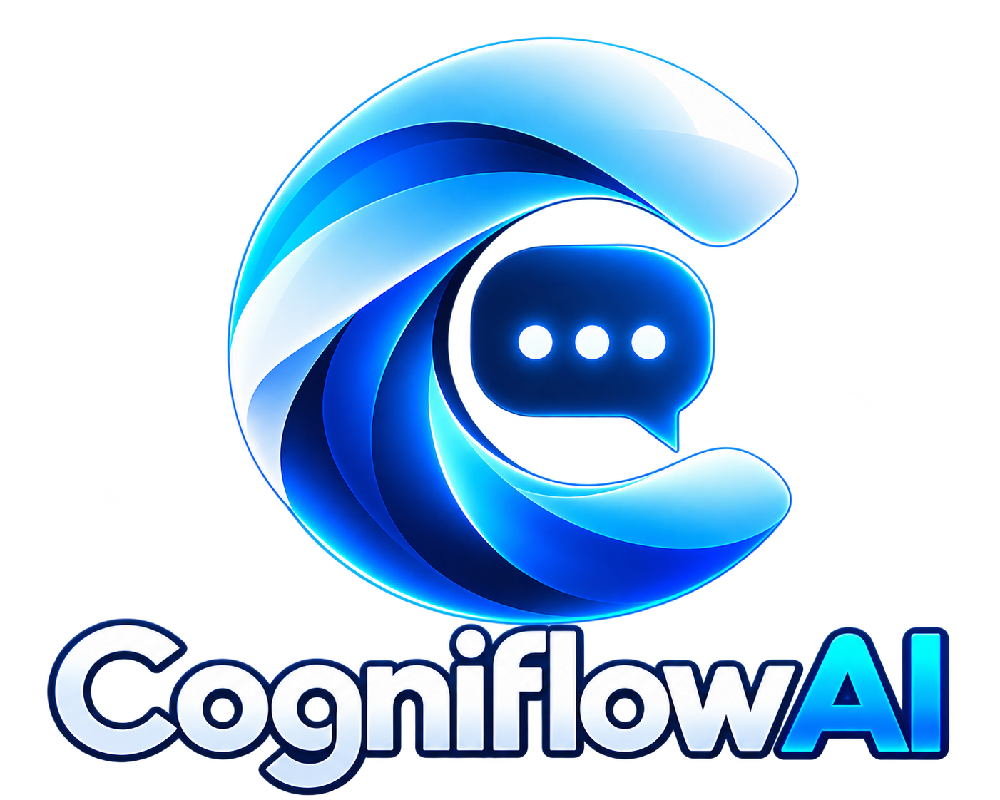
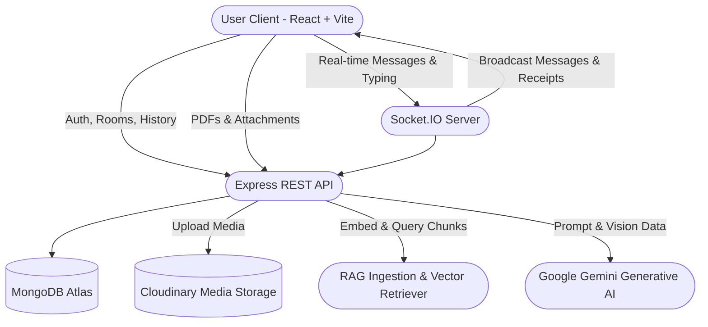

# 🧠 CogniFlow — Intelligent Real-Time Collaboration & RAG Knowledge Hub

<p align="center">
  
</p>

<p align="center">
  <strong>Next-Generation Team Collaboration Platform powered by Socket.IO & Multimodal Google Gemini AI</strong>
</p>

<p align="center">
  <a href="https://cogniflow-client.onrender.com" target="_blank">
    
  </a>
  
  
  
  
  
</p>

---

## 🌟 Overview

**CogniFlow** is a modern, full-stack real-time collaboration workspace built on the MERN stack (MongoDB, Express, React, Node.js). Designed for high-performing teams and learners, CogniFlow marries lightning-fast WebSocket communication with native multimodal AI through **CogniBot** and an integrated **RAG (Retrieval-Augmented Generation) Knowledge Hub**.

Users can chat in real-time, collaborate in channels, summon CogniBot in any room with `@cogni`, upload documents and images for instant AI vision inspection, and generate interactive quizzes or answers directly from their study material.

🔗 **Live Production Deployment:** [https://cogniflow-client.onrender.com](https://cogniflow-client.onrender.com)

---

## ⚡ Key Features

### 💬 Real-Time Messaging & Collaboration
- **Instant WebSockets:** Sub-millisecond messaging latency powered by Socket.IO rooms.
- **WhatsApp-Style Receipts:** Granular delivery status tracking:
  - ✓ **Sent** (Single gray tick)
  - ✓✓ **Delivered** (Double gray tick)
  - ✓✓ **Seen / Read** (Double blue tick)
- **Live Typing Indicators:** Animated typing dots triggered when users or CogniBot are generating messages.
- **Direct & Group Chats:** Create 1-on-1 private channels or multi-user rooms with custom titles and avatars.
- **Presence Tracking:** Real-time online/offline indicators for all contacts.

### 🤖 Multimodal AI Assistant (CogniBot)
- **Tag `@cogni` in Any Room:** Summon AI directly in group discussions for instant consensus, calculations, or coding help.
- **Gemini AI Vision:** Attach images (`.png`, `.jpg`, `.webp`) or documents, and CogniBot analyzes them visually using Google Gemini's native multimodal capabilities.
- **Robust Model Fallback Engine:** Dynamic failover across high-tier Google Generative AI models (`gemma-4-26b-a4b-it` → `gemini-2.5-flash` → `gemini-2.0-flash` → `gemini-1.5-flash` → `gemini-1.5-pro`) to ensure high availability and rate-limit resilience.
- **Markdown & Code Highlighting:** Responses are beautifully formatted with full markdown tables, lists, and syntax blocks.

### 📚 RAG Study & Knowledge Hub
- **Document Ingestion:** Upload PDF textbooks, lecture notes, or research papers.
- **Vector Retrieval:** Text chunking and cosine similarity retrieval over ingested knowledge.
- **Interactive Quiz Generator:** Automatically synthesize custom multiple-choice quizzes with explanations based on your documents.
- **Meta AI-Style Launcher:** Smooth floating launcher with expandable hover animation and slide-in drawer/modal for seamless multi-tasking.

### 🎨 Apple-Grade Aesthetic & Design System
- **Dynamic Particle Background:** Interactive particle physics canvas rendering smoothly in the background across all pages (Home, Auth, and Dashboard).
- **Glassmorphism & Dark Mode:** Carefully balanced translucency, subtle borders, and smooth transitions tailored for low-light focus.
- **Zero Placeholder Polish:** Clean branded SVG/PNG icons and custom typography.

---

## 🏗️ Architecture & Flow



---

## 📁 Repository Structure

```
CogniFlow/
├── client/                     # Frontend Application (React 18 + Vite)
│   ├── public/
│   │   └── images/             # Canonical application branding & assets
│   │       ├── CogniFlow.png
│   │       ├── ai-button-logo.png
│   │       └── RoomChat.png
│   ├── src/
│   │   ├── components/         # Reusable UI & feature components
│   │   │   ├── auth/           # Login / Register forms
│   │   │   ├── chat/           # ChatContainer, MessageItem, InputBox
│   │   │   ├── rag/            # CogniAiModal, QuizView, ModeSelector
│   │   │   ├── sidebar/        # Sidebar, RoomCard, SidebarHeader
│   │   │   └── ui/             # Buttons, Modals, Avatars, Particles
│   │   ├── hooks/              # Custom React hooks (useChat, useSocket, etc.)
│   │   ├── pages/              # Route views (HomePage, AuthPage, Dashboard)
│   │   ├── App.jsx             # Main router & global state
│   │   ├── index.css           # Tailwind & CSS design system
│   │   └── main.jsx            # Application entry point
│   ├── .env.example            # Sample client environment variables
│   ├── package.json
│   └── vite.config.js
│
├── server/                     # Backend Application (Node.js + Express)
│   ├── config/                 # Database & Cloudinary configurations
│   ├── controllers/            # Route controllers
│   │   ├── Auth/               # Register & Login controllers
│   │   ├── Message/            # Send, edit, delete, receipt controllers
│   │   ├── Rag/                # Upload, ingest, query, quiz controllers
│   │   ├── Room/               # Room creation & member management
│   │   └── User/               # User search & profile controllers
│   ├── middlewares/            # JWT authentication & Multer upload middlewares
│   ├── models/                 # Mongoose schemas (User, Room, Message, KnowledgeChunk)
│   ├── routes/                 # Express API routes
│   ├── services/rag/           # RAG chunker, parser & cosine similarity retriever
│   ├── socket/                 # Socket.IO connection & event handlers
│   ├── utils/                  # Gemini client & multi-model fallback cascade
│   ├── uploads/                # Temporary file processing directory (.gitkeep)
│   ├── .env.example            # Sample server environment variables
│   ├── index.js                # Server entry point
│   └── package.json
│
├── files/                      # Project documentation, plans & audit reports
│   ├── DESIGN-apple.md
│   ├── IMPLEMENTATION_PLAN.md
│   ├── RAG_IMPLEMENTATION_PLAN.md
│   └── REPORT.md
│
├── .gitignore                  # Git exclusions (node_modules, uploads, .env)
└── README.md                   # Project documentation
```

---

## 🚀 Getting Started

### Prerequisites
- **Node.js**: v18.0.0 or higher
- **npm** or **yarn**
- **MongoDB Atlas** database connection URI
- **Cloudinary** account (for media storage)
- **Google Gemini API Key** (from [Google AI Studio](https://aistudio.google.com/))

---

### 1. Clone the Repository
```bash
git clone https://github.com/Shashank028R/CogniFlow.git
cd CogniFlow
```

---

### 2. Configure Backend (`server`)

1. Navigate to the server folder:
   ```bash
   cd server
   ```

2. Install dependencies:
   ```bash
   npm install
   ```

3. Create a `.env` file based on `.env.example`:
   ```bash
   cp .env.example .env
   ```

4. Populate your environment variables in `server/.env`:
   ```env
   PORT=3000
   MONGODB_URI=mongodb+srv://<username>:<password>@cluster.mongodb.net/cogniflow?retryWrites=true&w=majority
   JWT_SECRET=your_super_secret_jwt_key
   CLOUDINARY_CLOUD_NAME=your_cloudinary_cloud_name
   CLOUDINARY_API_KEY=your_cloudinary_api_key
   CLOUDINARY_API_SECRET=your_cloudinary_api_secret
   GEMINI_API_KEY=your_google_gemini_api_key
   ```

5. Start the backend development server:
   ```bash
   npm start
   ```
   *The server runs by default on `http://localhost:3000`.*

---

### 3. Configure Frontend (`client`)

1. Open a new terminal and navigate to the client folder:
   ```bash
   cd client
   ```

2. Install dependencies:
   ```bash
   npm install
   ```

3. Create a `.env` file based on `.env.example`:
   ```bash
   cp .env.example .env
   ```

4. Set the backend URL in `client/.env`:
   ```env
   VITE_BACKEND_URL=http://localhost:3000
   ```

5. Start the client dev server:
   ```bash
   npm run dev
   ```
   *The client opens by default at `http://localhost:5173`.*

---

## 📡 API Reference

### Authentication
| Method | Endpoint | Description |
|---|---|---|
| `POST` | `/api/auth/register` | Register a new user account |
| `POST` | `/api/auth/login` | Authenticate user & receive JWT token |

### Users & Directory
| Method | Endpoint | Description |
|---|---|---|
| `GET` | `/api/users/search?q=...` | Search users by name or email |
| `GET` | `/api/users/profile` | Fetch authenticated user profile |
| `PUT` | `/api/users/profile` | Update user profile or avatar |

### Rooms & Channels
| Method | Endpoint | Description |
|---|---|---|
| `GET` | `/api/rooms` | Retrieve all active rooms for user |
| `POST` | `/api/rooms` | Create a direct 1-on-1 or group room |
| `PUT` | `/api/rooms/:id/members` | Add or remove members from group |

### Messages & AI Interactions
| Method | Endpoint | Description |
|---|---|---|
| `GET` | `/api/messages/:roomId` | Fetch paginated chat history for room |
| `POST` | `/api/messages` | Send message (triggers CogniBot on `@cogni` or DM) |
| `PUT` | `/api/messages/:id` | Edit an existing message |
| `DELETE` | `/api/messages/:id` | Delete a message |

### RAG & Knowledge Hub
| Method | Endpoint | Description |
|---|---|---|
| `POST` | `/api/rag/upload` | Ingest PDF document, chunk and store embeddings |
| `POST` | `/api/rag/query` | Ask questions over uploaded document context |
| `POST` | `/api/rag/quiz` | Generate customized interactive quiz from document |

### Media Uploads
| Method | Endpoint | Description |
|---|---|---|
| `POST` | `/api/upload` | Upload image/document to Cloudinary (returns URL) |

---

## 🔌 Socket.IO Events

| Event Name | Direction | Payload / Purpose |
|---|---|---|
| `setup` | Client → Server | Connect user and join user-specific socket channel |
| `join chat` | Client → Server | Join room channel for real-time messaging |
| `new message` | Client → Server | Broadcast message to room members |
| `message received` | Server → Client | Deliver new message to active recipients |
| `message delivered` | Both | Update message status to double gray ticks |
| `message read` | Both | Update message status to double blue ticks |
| `typing` | Client → Server | Broadcast typing indicator for user/room |
| `stop typing` | Client → Server | Clear typing indicator |
| `cogni_typing` | Server → Client | Indicate CogniBot is synthesizing a response |

---

## 🛡️ Security & Best Practices

- **Token-Based Authentication:** Signed JWT tokens with expiration handling.
- **Secure Secret Isolation:** Sensitive keys (Gemini, Mongo, Cloudinary) isolated strictly to backend environment.
- **Input Sanitization:** Multi-layered validation for incoming prompts, message bodies, and file uploads.
- **Clean Repository Hygiene:** Zero tracked node_modules, build artifacts, or uploads in source control.

---

## 🤝 Contributing

Contributions are welcome! Please follow these steps:

1. **Fork the repository**
2. **Create a feature branch:**
   ```bash
   git checkout -b feature/amazing-feature
   ```
3. **Commit your changes:**
   ```bash
   git commit -m "feat: add amazing feature"
   ```
4. **Push to the branch:**
   ```bash
   git push origin feature/amazing-feature
   ```
5. **Open a Pull Request**

---

## 📄 License

Distributed under the **MIT License**. See `LICENSE` for more information.

---

## 👨‍💻 Author & Support

- **Author:** [Shashank](https://github.com/Shashank028R)
- **Email:** [shashankmuz3@gmail.com](mailto:shashankmuz3@gmail.com)
- **Project Link:** [https://github.com/Shashank028R/CogniFlow](https://github.com/Shashank028R/CogniFlow)
- **Live Demo:** [https://cogniflow-client.onrender.com](https://cogniflow-client.onrender.com)
