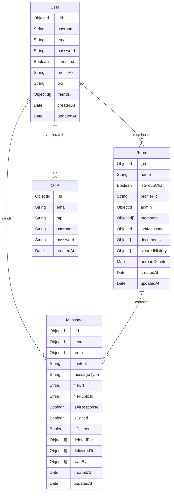

# CogniFlow — Comprehensive Project Report & Interview Reference

**Project Name:** CogniFlow  
**Repository:** [https://github.com/Shashank028R/CogniFlow](https://github.com/Shashank028R/CogniFlow)  
**Application Type:** Full-Stack Real-Time Chat & Multimodal AI Platform  
**Live Development Status:** Active & Tested  
- **Backend API:** [http://localhost:3000](http://localhost:3000) (Status: Connected to MongoDB Atlas & Socket.IO Active)  
- **Frontend Client:** [http://localhost:5173](http://localhost:5173) (Status: Vite Dev Server Active)  

---

## 1. One-Paragraph Pitch (Executive Summary)

> "CogniFlow is a full-stack real-time chat platform built on the MERN stack with Socket.IO for WebSockets and Google's Gemini API for an embedded AI assistant. It supports one-on-one and group messaging, WhatsApp-style read receipts, image/file sharing via Cloudinary, and a native bot — CogniBot — that participates directly in conversations, including understanding images sent to it. I built it to practice real-time system design, not just CRUD APIs: handling presence, delivery guarantees, and concurrent socket connections properly is a different problem than a typical REST app."

---

## 2. Tech Stack — What & Why

| Layer | Choice | Version | Why this choice (talking points) |
|---|---|---|---|
| **Frontend Framework** | React | `^19.2.5` | Component reuse, modern hooks for declarative state, latest React 19 concurrent features. |
| **Build Tool** | Vite | `^8.0.10` | ESM-native dev server with instant HMR and optimized production bundling. |
| **Styling** | TailwindCSS | `^4.2.4` | Utility-first design tokens with seamless dark/light mode, clean enterprise SaaS typography, and crisp border elevation. |
| **Real-Time Transport**| Socket.IO | `^4.8.3` | Handles WebSocket fallback (long-polling), built-in room clustering (`socket.join`), and auto-reconnection. |
| **Backend Framework** | Express | `^5.2.1` | Minimal, robust, middleware pipeline; native support for modern asynchronous routing. |
| **Database & ODM** | MongoDB + Mongoose | `^9.6.1` | Chat data is naturally document-shaped (messages, rooms with embedded members & receipts); avoids heavy multi-table SQL joins. |
| **AI Engine** | Google Generative AI | `^0.24.1` | Native multimodal capability (Gemma / Gemini) accepting text prompts + Base64 image payloads in a single turn. |
| **File Storage** | Cloudinary | `^1.41.3` | Automated media transformation, CDN URL delivery, and zero server disk bloat. |
| **Authentication** | JWT + Bcrypt | `^9.0.3` / `^6.0.0` | Stateless token authentication with adaptive salt rounds for secure password storage. |
| **Email Service** | Nodemailer | `^8.0.7` | Transactional email dispatch for 6-digit registration OTP codes via SMTP. |

### Architectural Defense: "Why MongoDB over PostgreSQL?"
Chat applications operate primarily on document-centric models: a message belongs to a single room, has dynamic arrays of member deliveries/reads, and conversation histories are append-heavy. Relational modeling requires join tables (`message_deliveries`, `message_reads`, `room_members`) for operations that fit cleanly as embedded sub-documents in MongoDB. The trade-off is eventual consistency over strict multi-document ACID transactions, which aligns with modern chat UX requirements.

---

## 3. System Architecture & Component Interactions

### 3.1 Architecture Diagram

```mermaid
graph TD
    Client["Client: React 19 + Vite + TailwindCSS<br/>(localhost:5173)"]
    API["Backend: Node.js Express 5<br/>(localhost:3000)"]
    Socket["Socket.IO Server<br/>(Real-Time Engine)"]
    DB[("MongoDB Atlas Database")]
    Cloudinary["Cloudinary Cloud Storage<br/>(Image/Attachment CDN)"]
    Gemini["Google Generative AI<br/>(CogniBot: Gemma / Gemini)"]
    SMTP["Nodemailer SMTP<br/>(Email OTP Verification)"]

    Client <-->|REST HTTP APIs (Axios)| API
    Client <-->|WebSockets bidirectional| Socket
    API <-->|Mongoose ODM| DB
    Socket <-->|Presence / Receipts Sync| DB
    API -->|Image Uploads| Cloudinary
    API -->|Prompts + Multimodal Vision| Gemini
    API -->|Verification Emails| SMTP
```

### 3.2 Dual Communication Channels: REST vs. WebSockets

- **REST (HTTP)**: Used for discrete, idempotent, or stateless operations — authentication, fetching paginated chat history, updating profiles, and uploading files via multipart form data.
- **WebSockets (Socket.IO)**: Used for event-driven server pushes where low latency is critical — new message broadcasting, real-time typing indicators, read receipts, and live user presence.

> **Rule of thumb**: *If the client initiates a data query, use REST; if the server notifies the client of an unprompted state change, emit a WebSocket event.*

### 3.3 Backend Layered Structure

```
server/
├── config/           # Cloudinary SDK credentials configuration
├── controllers/      # Business logic segregated by domain (Auth, Chat, Message, Upload, User)
├── middlewares/      # Cross-cutting concerns (JWT auth verification)
├── models/           # Mongoose schemas & indexes (User, Room, Message, OTP)
├── routes/           # REST endpoint routers mapped to controllers
├── socket/           # WebSocket event lifecycle and room message routing
├── utils/            # Shared utilities (AI client, DB connection, Mailer, CogniBot provisioning)
└── index.js          # Server bootstrap & Socket.IO initialization
```

### 3.4 Frontend Domain Structure

Organized by feature domain under `client/src/components/`:
- `auth/`: Login, registration, and protected route wrapper (`ProtectedRoute.jsx`).
- `chat/`: Core conversation window (`ChatContainer.jsx`), message actions, group management modal (`GroupSettingsModal.jsx`).
- `sidebar/`: Chat listing (`RoomList.jsx`, `RoomCard.jsx`), user search (`SearchBar.jsx`), room creation (`RoomModal.jsx`).
- `ui/`: Design primitives (`Avatar.jsx`, `Button.jsx`, `Card.jsx`, `Input.jsx`, `ParticleBackground.jsx`).

---

## 4. Deep Dive: Core Subsystems

### 4.1 Real-Time Messaging & Socket Pipeline

- **Room Join Semantics**: Socket.IO's `socket.join(roomId)` partitions sockets into rooms so `io.to(roomId).emit(...)` delivers messages to active participants without manual socket-to-room book-keeping.
- **WhatsApp-Style Read Receipts**:
  1. **Sent ($\checkmark$)**: Message document created in MongoDB.
  2. **Delivered ($\checkmark\checkmark$ gray)**: Emitted via `mark delivered` event; recipient's client adds its ID to `deliveredTo` in MongoDB.
  3. **Read ($\checkmark\checkmark$ blue/cyan)**: Emitted via `mark read` event; recipient's client adds its ID to `readBy` upon message viewport intersection.
- **Ephemeral Typing Indicators**: Emitted as lightweight socket events (`typing` / `stop typing`) without database persistence, keeping write throughput clean.
- **Chat Clearing**: Per-user soft clearing implemented via `clearedHistory: [{ user, timestamp }]` on the `Room` model. Fetching messages filters out messages older than the user's clear timestamp without deleting messages for other members.

### 4.2 CogniBot — Embedded Multimodal AI Subsystem

- **Bot as a First-Class User**: CogniBot is provisioned on server boot (`initCogniBot.js`) with an explicit ObjectId, username `"CogniBot"`, and email `"cognibot@cogniflow.ai"`. This architectural decision means the bot shares the same room models, schemas, and message pipelines as human users with zero bespoke schema branching.
- **Trigger Heuristics**:
  - **1-on-1 Chat**: Any message sent in a room where one member is `global.cogniBotId` automatically dispatches to the AI.
  - **Group Chat**: Requires explicit `@cogni` tag to prevent excessive AI chatter and token consumption.
- **Multimodal Image Analysis**:
  ```
  User uploads image → Cloudinary returns CDN URL → Backend downloads image
  → Converts to Base64 inlineData → Sends to Gemini alongside conversation context
  → AI responds with structured <response>...</response> output.
  ```
- **Live Typing Feedback**: The backend emits `typing` to the room during Gemini inference and `stop typing` upon response creation.

### 4.3 Storage & File Handling Pipeline

- **Images**: Parsed by Multer, uploaded to Cloudinary folder `cogniflow`, and the local temporary file is removed immediately with `fs.unlinkSync`.
- **Documents & PDFs**: Stored in `/uploads` on the server and served statically via Express.

### 4.4 Authentication & Security Pipeline

- **Registration**: Password hashed using `bcrypt` (10 salt rounds). Generates a cryptographically random 6-digit numeric OTP (`crypto.randomInt(100000, 999999)`), stored in a dedicated `OTP` collection.
- **Email Dispatch**: HTML OTP sent to the user via Nodemailer.
- **Verification**: OTP checked; on success, a verified `User` record is created.
- **Session Tokens**: JWT signed with 30-day expiration and validated on protected endpoints via `authMiddleware.js`.

---

## 5. Database Schema & Data Models



### High-Value Indexes
- `Room`: `{ members: 1 }` index optimizes room listing queries for any user.
- `User`: `{ email: 1 }` and `{ username: 1 }` unique indexes prevent duplicate accounts.
- `Message`: Implicit index on `_id` and room-based sorting for chat history pagination.

---

## 6. Comprehensive API Reference

### 6.1 Authentication (`/api/auth`)
| Method | Endpoint | Description | Auth Required |
|---|---|---|---|
| `POST` | `/api/auth/register` | Initiates registration & sends email OTP | No |
| `POST` | `/api/auth/verify-email` | Validates OTP & creates verified User document | No |
| `POST` | `/api/auth/login` | Validates credentials & issues JWT token | No |

### 6.2 Chat Rooms (`/api/chat`)
| Method | Endpoint | Description | Auth Required |
|---|---|---|---|
| `POST` | `/api/chat` | Creates or fetches a 1-on-1 room or creates group | Yes (JWT) |
| `GET` | `/api/chat` | Fetches all chat rooms belonging to user | Yes (JWT) |
| `PUT` | `/api/chat/:roomId/read` | Marks room messages as read and resets unread count | Yes (JWT) |
| `PUT` | `/api/chat/rename` | Renames group chat (admin only) | Yes (JWT) |
| `PUT` | `/api/chat/groupadd` | Adds user(s) to existing group chat | Yes (JWT) |
| `PUT` | `/api/chat/groupremove` | Removes user or leaves group chat | Yes (JWT) |
| `DELETE`| `/api/chat/:roomId` | Deletes entire group room (admin only) | Yes (JWT) |

### 6.3 Messages (`/api/messages`)
| Method | Endpoint | Description | Auth Required |
|---|---|---|---|
| `POST` | `/api/messages` | Sends a message; triggers CogniBot if AI DM or `@cogni` | Yes (JWT) |
| `GET` | `/api/messages/:roomId` | Fetches conversation history respecting cleared timestamps | Yes (JWT) |
| `PUT` | `/api/messages/:messageId` | Edits an existing message | Yes (JWT) |
| `DELETE`| `/api/messages/:messageId` | Deletes message ("for me" or "for everyone") | Yes (JWT) |
| `DELETE`| `/api/messages/room/:roomId`| Soft clears user's chat history for room | Yes (JWT) |

### 6.4 Uploads & Users (`/api/upload`, `/api/user`)
| Method | Endpoint | Description | Auth Required |
|---|---|---|---|
| `POST` | `/api/upload` | Multipart file upload (Cloudinary for images, disk for files) | Yes (JWT) |
| `GET` | `/api/user` | Search users by query string | Yes (JWT) |
| `GET` | `/api/user/profile` | Retrieve authenticated user profile | Yes (JWT) |
| `PUT` | `/api/user/profile` | Update user bio and avatar | Yes (JWT) |

### 6.5 WebSocket Events (Socket.IO)
| Event | Direction | Payload | Description |
|---|---|---|---|
| `setup` | Client → Server | `userId` | Joins private user room; registers presence |
| `join chat` | Client → Server | `roomId` | Joins specific room socket channel |
| `new message` | Client → Server → Client | `Message` object | Real-time message dispatch to room members |
| `message edited` | Client → Server → Client | `Message` object | Propagates message edits in real time |
| `message deleted` | Client → Server → Client | `Message` object | Propagates soft/hard message deletions |
| `mark delivered` | Client → Server → Client | `{ messageIds, userId, roomId }` | Updates delivery status |
| `mark read` | Client → Server → Client | `{ messageIds, userId, roomId }` | Updates read status |
| `typing` / `stop typing` | Bidirectional | `roomId` | Live typing indicator animation |
| `get online users` | Server → Client | `string[]` | Array of online user IDs |

---

## 7. Trade-offs & Engineering Decisions

| Decision | Trade-Off Made | Production Reality / Alternative |
|---|---|---|
| **MongoDB over PostgreSQL** | Flexible document modeling vs. weaker cross-collection transactional integrity | Appropriate for append-heavy chat; SQL would need multiple join tables for receipts. |
| **Stateless JWTs** | Easy horizontal scaling vs. cannot instantly revoke compromised tokens | Can be hardened with short-lived access tokens + refresh tokens stored in Redis. |
| **Embedded Receipts Array** | O(1) read performance when loading messages vs. array unbounded growth | Scales well for 2-50 member chats; large channels (10,000+) require receipt aggregation. |
| **Bot as a User Document** | Uniform schema reuse across all chat features vs. conceptual code-as-user entity | Drastically simplifies frontend and backend room logic. |
| **Local Disk for Documents** | Fast initial implementation vs. loss of files on ephemeral cloud restarts | Migrating non-image files to Cloudinary `resource_type: "raw"` solves persistence. |
| **JWT in localStorage** | Zero-friction client implementation vs. vulnerability to XSS | Standard hardening path: move to `httpOnly` secure cookies. |

---

## 8. Implementation Plan Status (Audit & Execution)

The implementation plan is maintained in [files/IMPLEMENTATION_PLAN.md](IMPLEMENTATION_PLAN.md):

| Phase | Focus | Status | Key Highlights |
|---|---|---|---|
| **Phase 0** | Critical Fixes | 🟡 In Progress | Step 0.1 (`cors` added to `server/package.json`) completed; multi-tab presence & storage fixes queued. |
| **Phase 1** | Security & Reliability | ⏳ Planned | Rate limiting (`express-rate-limit`), Zod request schemas, `httpOnly` cookies. |
| **Phase 2** | Core Chat Features | ⏳ Planned | Emoji reactions, quoted replies, in-room text search, voice audio notes. |
| **Phase 3** | CogniBot Upgrades | ⏳ Planned | Rolling conversation memory, slash commands (`/summarize`, `/imagine`), streaming responses. |
| **Phase 4** | Presence & Push | ⏳ Planned | Last-seen timestamps, Web Push notifications, group invite tokens. |
| **Phase 5** | CI/CD & Deployment | ⏳ Planned | Docker containerization, Jest/Supertest suite, GitHub Actions CI. |
| **Phase 6** | Frontend Polish & UI Redesign | ✅ In Progress | Modern professional SaaS UI overhaul completed (eliminated neumorphism, removed neon glows and glassmorphism, refined subtle ambient particle mesh, added skeleton states). |

---

## 9. Anticipated Interview Questions & Model Answers

### Q1: "Walk me through what happens when a user sends a message."
> "When a user types a message and clicks send, the React client executes `POST /api/messages` with the room ID, content, and optional attachment details. The Express `sendMessage` controller validates room membership and creates a `Message` document in MongoDB, incrementing unread counters on the room. If the chat is a 1-on-1 with CogniBot or mentions `@cogni`, an asynchronous task feeds recent chat context and any image attachment to Gemini, which streams back or generates an AI response. Simultaneously, the server emits `new message` over Socket.IO to all room members. As other clients receive and scroll to the message, they emit `mark delivered` and `mark read`, transitioning the checkmark from single gray to double gray to double cyan."

### Q2: "How would you scale this system to 100,000 concurrent connections?"
> "A single Node.js instance tops out around 10,000 to 20,000 concurrent sockets depending on message frequency. To scale:
> 1. **Socket.IO Redis Adapter**: Distribute socket connections across multiple Node instances behind an NGINX load balancer with sticky sessions, using Redis Pub/Sub to cross-broadcast messages.
> 2. **AI Task Queue**: Offload Gemini AI calls to a BullMQ worker queue to isolate external API latency and manage API rate-limiting cleanly.
> 3. **Database Sharding & Caching**: Shard MongoDB messages by `roomId` and cache recent room histories in Redis."

---

## 10. Live Operational Health Verification

Both services have been executed and verified in this environment:
- **Backend Server (`node index.js`)**: Listening on `http://localhost:3000`, connected to MongoDB Atlas, CogniBot initialized.
- **Frontend Client (`npm run dev`)**: Listening on `http://localhost:5173`, Vite bundled dependencies and served App shell.
